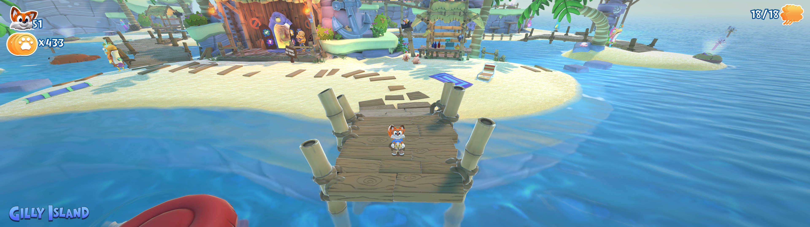

## New Super Lucky's Tale ultrawide and superwide fix

The tool removes the side black bars and corrects the user interface at 21:9 and 32:9 display resolutions. 

1. [Download](/../../releases) and unpack the archive.
2. Launch the game first, followed by the tool.
3. Enable the resolution-related fixes while in the main menu. Alternatively, toggle fullscreen in the game for the changes to be visible.

All trainers based on CE components may trigger some anti-virus software.

Tested on the latest Xbox Game Pass / Microsoft Store version at 2560x1080 and 3840x1080.
Additionally verified by a WSGF member at 3440x1440.

You can buy me a [coffee](https://ko-fi.com/rozziroxx) or become a [patron](https://www.patreon.com/rozzi).

